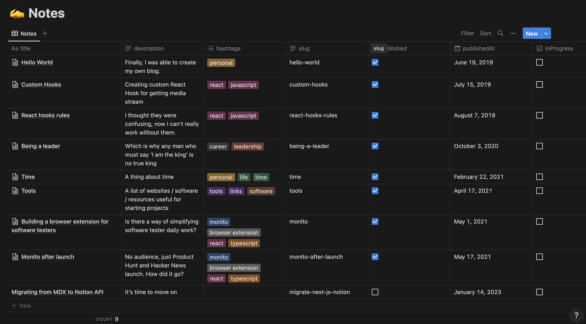

<div style="display: flex; justify-content: space-between; align-items: center; margin-bottom: 1em;">
  <h1 style="margin: 0;">siRizqi - Portfolio Website</h1>
  <a href="https://vercel.com/new/clone?repository-url=https%3A%2F%2Fgithub.com%2FBartoszJarocki%2Fweb-jarocki-me">
    
  </a>
</div>

[](https://choosealicense.com/licenses/mit/)
[](https://nextjs.org/)
[](https://typescriptlang.org/)

> A modern, performant personal website built with Next.js and Notion as a headless CMS

[**🌐 Live Demo**](https://rizqisarasajati.com) | [**📚 Documentation**](#documentation)

---

## Table of Contents

- [siRizqi - Personal Website ](#bartosz-jarocki---personal-website-)
  - [Table of Contents](#table-of-contents)
  - [Features](#features)
  - [Tech Stack](#tech-stack)
  - [Getting Started](#getting-started)
    - [Prerequisites](#prerequisites)
    - [Quick Start](#quick-start)
  - [Environment Setup](#environment-setup)
    - [Getting Notion Credentials](#getting-notion-credentials)
  - [Notion Database Configuration](#notion-database-configuration)
    - [Database Template](#database-template)
  - [Development](#development)
    - [Available Scripts](#available-scripts)
    - [Project Structure](#project-structure)
  - [Deployment](#deployment)
    - [Deploy to Vercel (Recommended)](#deploy-to-vercel-recommended)
    - [Other Platforms](#other-platforms)
  - [OG Image Generation](#og-image-generation)
    - [Examples](#examples)
    - [Customization](#customization)
  - [Contributing](#contributing)
    - [Ways to Contribute](#ways-to-contribute)
    - [Development Workflow](#development-workflow)
    - [Code Standards](#code-standards)
  - [Troubleshooting](#troubleshooting)
    - [Common Issues](#common-issues)
    - [Performance Issues](#performance-issues)
    - [Need More Help?](#need-more-help)
  - [License](#license)
    - [What This Means](#what-this-means)

---

## Features

✨ **Core Features**

- 🚀 **Blazing Fast** - Built with Next.js 14 and optimized for performance
- 📝 **Notion CMS Integration** - Seamless content management through Notion
- 🌙 **Dark/Light Mode** - Automatic theme switching with system preference detection
- 📱 **Fully Responsive** - Mobile-first design that works on all devices
- 🔍 **SEO Optimized** - Built-in SEO with NextSEO and automatic sitemap generation

🎨 **Design & UX**

- ⚡ **Lightning-fast Loading** - Static generation with Incremental Static Regeneration
- 🖼️ **Dynamic OG Images** - Auto-generated Open Graph images for social sharing
- 🏷️ **Smart Tagging System** - Organize and filter content with tags
- 📊 **Analytics Ready** - Vercel Analytics integration
- 🎯 **Accessibility First** - WCAG compliant design

🛠️ **Developer Experience**

- 🔧 **TypeScript** - Full type safety throughout the application
- 🎨 **Tailwind CSS** - Utility-first styling with custom design system
- 📦 **Modern Tooling** - ESLint, Prettier, and automated workflows
- 🔄 **Hot Reload** - Instant feedback during development
- 📈 **Performance Monitoring** - Built-in performance tracking

---

## Tech Stack

This project leverages modern web technologies for optimal performance and developer experience:

| Technology                                                                            | Purpose          | Why This Choice                             |
| ------------------------------------------------------------------------------------- | ---------------- | ------------------------------------------- |
| **[Next.js 14](https://nextjs.org/)**                                                 | React Framework  | App Router, SSG/ISR, built-in optimizations |
| **[TypeScript](https://typescriptlang.org/)**                                         | Type Safety      | Enhanced DX, fewer runtime errors           |
| **[Notion API](https://developers.notion.com/)**                                      | Headless CMS     | Non-technical content management            |
| **[Tailwind CSS](https://tailwindcss.com/)**                                          | Styling          | Rapid development, consistent design        |
| **[Next Themes](https://github.com/pacocoursey/next-themes)**                         | Theme Management | Seamless dark/light mode switching          |
| **[Vercel OG](https://vercel.com/docs/functions/edge-functions/og-image-generation)** | OG Images        | Dynamic social media previews               |
| **[NextSEO](https://github.com/garmeeh/next-seo)**                                    | SEO Optimization | Better search engine visibility             |
| **[Framer Motion](https://framer.com/motion/)**                                       | Animations       | Smooth, performant animations               |

---

## Getting Started

### Prerequisites

- Node.js 18+ and yarn
- A Notion account and workspace
- Git

### Quick Start

1. **Clone the repository**

   ```bash
   git clone https://github.com/sirizqi/portfolio.git
   cd portfolio
   ```

2. **Install dependencies**

   ```bash
   yarn install
   ```

3. **Set up environment variables**

   ```bash
   cp .env.example .env.local
   # Edit .env.local with your values
   ```

4. **Configure your Notion database** (see [Notion setup](#notion-database-configuration))

5. **Start development server**

   ```bash
   yarn dev
   ```

6. **Open [http://localhost:3000](http://localhost:3000)** in your browser

---

## Environment Setup

Create a `.env.local` file in the root directory with the following variables:

```env
# Required: Base URL for canonical links and OG images
NEXT_PUBLIC_URL=https://yourdomain.com

# Required: Notion API integration token
NOTION_TOKEN=your_notion_integration_token

# Required: Your Notion database ID
NOTION_DATABASE_ID=your_database_id
```

### Getting Notion Credentials

1. **Create a Notion Integration**

   - Go to [Notion Developers](https://developers.notion.com/)
   - Create a new integration and copy the token

2. **Get Database ID**

   - Open your Notion database
   - Copy the ID from the URL: `notion.so/username/DATABASE_ID?v=...`

3. **Connect Integration to Database**
   - In your Notion database, click "..." → "Connections" → Add your integration

---

## Notion Database Configuration

Your Notion database must include these properties for the application to work correctly:

| Property      | Type          | Required | Description                    |
| ------------- | ------------- | -------- | ------------------------------ |
| `title`       | Title         | ✅       | Post title (primary property)  |
| `slug`        | Rich Text     | ✅       | URL slug (e.g., "hello-world") |
| `description` | Rich Text     | ✅       | Post excerpt/description       |
| `published`   | Checkbox      | ✅       | Whether post is published      |
| `publishedAt` | Date          | ✅       | Publication date               |
| `hashtags`    | Multi-select  | ✅       | Post tags/categories           |
| `inProgress`  | Checkbox      | ❌       | Shows "Work in Progress" badge |
| `cover`       | Files & Media | ❌       | Post cover image               |

### Database Template

Here's how your Notion database should look:



**Need help?** Check out our [detailed Notion setup guide](docs/notion-setup.md).

---

## Development

### Available Scripts

```bash
# Development
yarn dev          # Start development server
yarn build        # Build for production
yarn start        # Start production server

# Code Quality
yarn lint         # Run ESLint
yarn typecheck    # Run TypeScript checks
yarn format       # Format code with Prettier

# Utilities
yarn postbuild    # Generate sitemap (runs after build)
```

### Project Structure

```
src/
├── components/          # Reusable React components
│   ├── icons/          # SVG icon components
│   ├── notes/          # Blog/notes specific components
│   └── notion/         # Notion integration components
├── data/               # Static data and content
├── images/             # Static images (logos, travel photos)
├── lib/                # Utility functions and API clients
├── pages/              # Next.js pages (file-based routing)
│   ├── api/           # API routes (OG images, RSS)
│   ├── notes/         # Blog post pages
│   └── tags/          # Tag filtering pages
└── styles/             # Global styles and Prism themes
```

---

## Deployment

### Deploy to Vercel (Recommended)

[](https://vercel.com/new/clone?repository-url=https%3A%2F%2Fgithub.com%2FBartoszJarocki%2Fweb-jarocki-me)

1. Click the deploy button above
2. Configure environment variables in Vercel dashboard
3. Your site will be automatically deployed on every push to main

### Other Platforms

This is a standard Next.js application and can be deployed to:

- **Netlify** - Add build command: `yarn build && yarn export`
- **Railway** - Auto-deploys from Git with zero config
- **DigitalOcean App Platform** - Full-stack hosting
- **AWS Amplify** - Serverless hosting with CI/CD

---

## OG Image Generation

The application automatically generates Open Graph images for social media sharing using Vercel's Edge Functions.

### Examples

**Homepage**
![Homepage OG]

**Blog Post**
![Blog Post OG]

### Customization

Edit `src/pages/api/og.tsx` to customize:

- Font styles and sizes
- Color schemes
- Layout and positioning
- Dynamic elements

---

## Contributing

We welcome contributions! Here's how you can help:

### Ways to Contribute

### Development Workflow

1. **Fork the repository**
2. **Create a feature branch**

   ```bash
   git checkout -b feature/amazing-feature
   ```

3. **Make your changes**

   ```bash
   # Make sure tests pass and code is formatted
   yarn lint
   yarn typecheck
   yarn format
   ```

4. **Commit your changes**

   ```bash
   git commit -m 'Add amazing feature'
   ```

5. **Push to your fork**

   ```bash
   git push origin feature/amazing-feature
   ```

6. **Create a Pull Request**

### Code Standards

- **TypeScript** - All new code should be typed
- **ESLint/Prettier** - Code must pass linting and formatting
- **Components** - Follow existing patterns and naming conventions
- **Commits** - Use conventional commit messages

---

## Troubleshooting

### Common Issues

**Build Errors**

```bash
# Clear Next.js cache
rm -rf .next
yarn build

# Clear all caches
rm -rf .next node_modules yarn.lock
yarn install
```

**Notion API Issues**

- Verify your `NOTION_TOKEN` is correct
- Ensure the integration has access to your database
- Check that all required database properties exist

**Environment Variables**

- Ensure `.env.local` exists and contains all required variables
- Restart your development server after changing env vars
- Check that `NEXT_PUBLIC_URL` matches your deployment URL

**TypeScript Errors**

```bash
# Check for type errors
yarn typecheck

# Regenerate TypeScript cache
rm -rf .next/types
yarn dev
```

### Performance Issues

- **Slow builds?** Check if you have too many images in `/public`
- **Slow loading?** Verify your Notion database isn't too large
- **Memory issues?** Increase Node.js memory: `NODE_OPTIONS="--max-old-space-size=4096" yarn build`

### Need More Help?

- 📖 [Next.js Documentation](https://nextjs.org/docs)
- 🔗 [Notion API Docs](https://developers.notion.com/)

---

## License

This project is licensed under the MIT License - see the [LICENSE](LICENSE) file for details.

### What This Means

✅ **You can:**

- Use this code for personal or commercial projects
- Modify and distribute the code
- Create derivative works

❌ **You cannot:**

- Remove copyright notices
- Use our trademarks or branding

**Attribution appreciated but not required!**

---

<div align="center">

**[⬆ Back to Top]**

Made with ❤️ by [siRizqi](https://rizqisarasajati.com)

</div>
# portfolio
